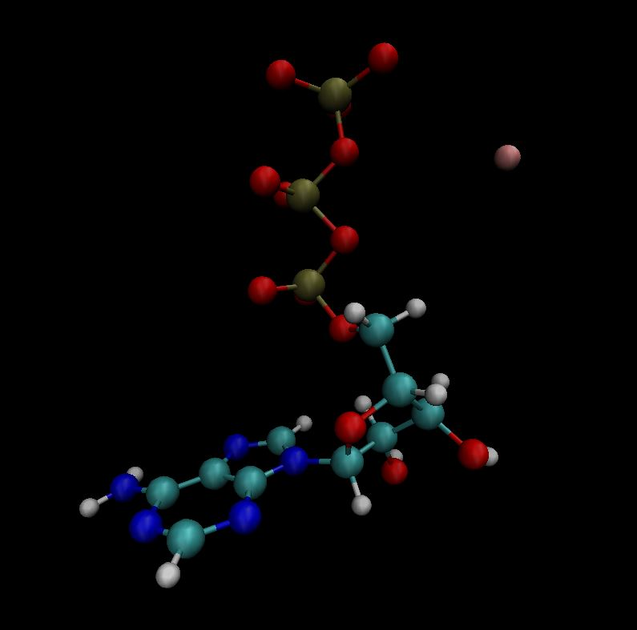

# [ou_et_al_2021](https://pubs.acs.org/doi/10.1021/jacsau.1c00316)
Reproduction of MD ATP simulation with lysozyme from *Ou et al (2021)*'s work.

# files
* `charmm36_ljpme-jul2021.ff` - CHARMM36 force field - 2021
* `atp_pro` - ATP simulation files (without Mg 2+)
   * `1iee_clean.pdb` - lyzozyme from PDB code: 1IEE, removed crystallized water and ions using the grep command on HOH CL NA respectively.
   * `atp.pdb` - ATP PDB sourced from CHARMM-GUI Archive - [Small molecule database](https://charmm-gui.org/?doc=archive&lib=csml)
   
   * `ions.mdp` - ions mdp to create a tpr to add ions within PDB. (contents don't matter)
   * `minim.mdp` - mdp file for energy minizimation, for 10,000 steps. 
   * `nvt.mdp` - mdp file for equilibration for NVT ensemble at 300 K.
   * `npt.mdp` - mdp file for equilibration for NPT ensemble at 1 bar.
   * `md.mdp` - mdp file for production MD for 400 ns. 
 
* `atp_mg` - ATP simulation files (with Mg 2+)
   * `atp.pdb`
   * `ions.mdp`
   * `minim.mdp`
   * `nvt.mdp` NVT, NPT and MD files updated with thermal coupling of ATP and Non ATP group from index.ndx
   * `npt.mdp`
   * `md.mdp` updated for 100 ns
   * `index.ndx` *example* index.ndx file with [non-ATP] group
 
notes from *ou_et_al* for mdp: 
- barostat - parrinello-rahman
- thermostat - velocity-rescaled Berendsen
- 12 angstrom cutoff distance
- LINCS algorithm to restrain bonds

# NOTE: ATP-MG CLUSTER RUN 13/03/23

- Introduce [Allner etal 2012](https://pubmed.ncbi.nlm.nih.gov/26596759/) - Magnesium LJ parameters]

|  | $\epsilon$ $_{lj}$ | $\epsilon$ $_{new}$ | $r_{orig}$ | $r_{new}$ |
|-  | - | -| -| -|
| Mg | 0.00627600 | 0.0123428  | 0.211142996199 | 0.2770000000| 

# OLD OLD OLD method. for ATP mdrun
notes from *ou_et_al* for prep: 20 ATP molecules are added, using a cubic box of 12.6nm per side and solvated with TIP3P water model. 
  * Setting up the simulation within gromacs via:
  1. Initial structure of lysozyme and ATP `gmx insert-molecules -f 1iee_clean.pdb -ci atp.pdb -o 1iee_atp.gro -nmol 20 `
  2. Generate topology files using `gmx pdb2gmx -f 1iee_atp.gro -o 1iee_processed.gro -water tip3p`
  3. Generate box `gmx editconf -f 1iee_processed.gro -o 1iee_newbox.gro -c -d 1.0 -bt cubic -box 12.6 12.6 12.6`
  4. Solvate with TIP3P water `gmx solvate -cp 1iee_newbox.gro -cs spc216.gro -o 1iee_solv.gro -p topol.top`
  5. Generate starting structure to add ions `gmx grompp -f ions.mdp -c 1iee_solv.gro -p topol.top -o ions.tpr`
  6. Add 150mM NaCl to system `gmx genion -s ions.tpr -o 1iee_solv_ions.gro -p topol.top -pname SOD -nname CLA -conc 0.15 -neutral`
  7. Generate starting structure for energy minimization `gmx grompp -f minim.mdp -c 1iee_solv_ions.gro -p topol.top -o em.tpr`
  8. Run `gmx mdrun -v -deffnm em`
  9. Repeat with equilibration with restraints `gmx grompp -f nvt.mdp -c em.gro -r em.gro -p topol.top -o nvt.tpr`
  10. `gmx mdrun -v -deffnm nvt`
  11. `gmx grompp -f npt.mdp -c nvt.gro -r nvt.gro -t nvt.cpt -p topol.top -o npt.tpr`
  12. `gmx mdrun -v -deffnm npt`
  * Production:
  13. `gmx grompp -f md.mdp -c npt.gro -t npt.cpt -p topol.top -o md_0_1.tpr`
  14. `gmx mdrun -v -deffnm md_0_1`
  15. Correct for periodicity and trajectory `gmx trjconv -s md_0_1.tpr -f md_0_1.xtc -o md_0_1_noPBC.xtc -pbc mol -center`

 # method.1 for ATP-Mg mdrun:
 
 * ATP Mg Complex. Method 1:
  Simulate ATP and MG 2+ without protein for 100ns. Step 1-7 = generating the system. 
 
 1. `gmx pdb2gmx -f atp.pdb -o atp_processed.gro -water tip3p`
 2. `gmx editconf -f atp_processed.gro -o atp_newbox.gro -c -d 1.0 -bt cubic`
 3. `gmx solvate -cp atp_newbox.gro -cs spc216.gro -o atp_solv.gro -p topol.top`
 4. `gmx grompp -f ions.mdp -c atp_solv.gro -p topol.top -o ions.tpr`
 5. `gmx genion -s ions.tpr -o atp_solv_ions.gro -p topol.top -pname MG -pq 2 -np 1`
 6. `gmx grompp -f ions.mdp -c atp_solv_ions.gro -p topol.top -o ions2.tpr`
 7. `gmx genion -s ions2.tpr -o atp_solv_ions2.gro -p topol.top -pname SOD -nname CLA -conc 0.15 -neutral`

* Step 8. Generate `index.ndx` file as no protein is present for thermal coupling groups
 
 8. `gmx make_ndx -f atp_solv_ions2.gro` generate a [non ATP] group to be used to couple in NVT, NPT and MD runs. 

* Step 9-16 = energy minimization, equilibration and production

 9. `gmx grompp -f minim.mdp -c atp_solv_ions2.gro -p topol.top -o em.tpr -n index.ndx`
 10. `gmx mdrun -v -deffnm em`
 11. `gmx grompp -f nvt.mdp -c em.gro -r em.gro -p topol.top -o nvt.tpr -n index.ndx`
 12. `gmx mdrun -v -deffnm nvt`
 13. `gmx grompp -f npt.mdp -c nvt.gro -r nvt.gro -t nvt.cpt -p topol.top -o npt.tpr`
 14. `gmx mdrun -v -deffnm npt`
 15. `gmx grompp -f md.mdp -c npt.gro -t npt.cpt -p topol.top -o md_0_1.tpr -n index.ndx`
 16. `gmx mdrun -v -deffnm md_0_1`

* Step 17 - X = Prepare ATP-Mg PDB for Protein mdrun 

 17. `gmx trjconv -s md.tpr -f md.xtc -o atp_mg.pdb -pbc mol -center -conect`
 18. In VMD, selected frame in which ATP interacts with Mg and within VMD export a PDB file without the NaCl solution. 
 19. Follow Step 1. onwards from method. for ATP mdrun

 

Image shown as frame exported as `atpmg.pdb`.

# method.2 for ATP-Mg mdrun:
method was trialled as [*Hu et al (2022)*](https://pubs.acs.org/doi/abs/10.1021/acs.jpcb.2c01478) uses this method... 
* ATP Mg Complex. Method 2:
For ATP-Mg Complex. Step 6.1 is added as:
  
 6.1. Add 20 Mg 2+ to system: `gmx genion -s ions.tpr -o 1iee_solv_mg.gro -p topol.top -pname MG -pq 2 -np 20`

 6.2.  Add 150mM NaCl to system `gmx genion -s ions.tpr -o 1iee_solv_ions.gro -p topol.top -pname SOD -nname CLA -conc 0.15 -neutral`

and continue with ATP mdrun method. 
# gromacs
Gromacs version - 2021.5
